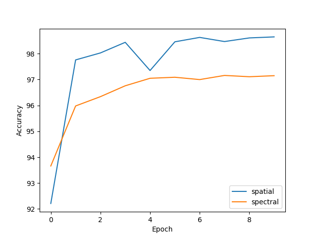

# SpecNet
Replication a series of networks completely training and inferencing over spectral/frequency domain. Implemented in **Pytorch**.

## Inplementation Detail
### Frequency Domain Operations
In this part, I mainly refer to following works:
> Bochen Guan, Jinnian Zhang, William A. Sethares, Richard Kijowski, Fang Liu.   
> **SPECTRAL DOMAIN CONVOLUTIONAL NEURAL NETWORK**  
> _2021 ICASSP_.

> Oren Rippel, Jasper Snoek, Ryan P. Adams.   
> **Spectral Representations for Convolutional Neural Networks**  
> _2015 NIPS_.

The current implementation supports following operations in frequency domain  
* FFT layer & IFFT layer
* Spectral Convolution (Elementwise production)
* Spectral Pooling
* Spectral Activation (Tanh)

_**Todo**_
* Spectral Normalization

### Efficiency and enery saving
Current inplementation only includes once FFT and once IFFT in the whole structure. However, this is still not efficiently and memory saving inplemented.  
 First, the inplmentation of spectral kernel is relized by such: saving in the spatial domain and using FFT to transform it into frequency domain and do the forwarding. This results in overheads of doing FFT over conv kernel.   
 Second, the parameter is also not memory saving. Because of the conjactory feature of spectral graph, we do not need to save $n^2$ complex numbers instead of $O(n^2)$ space complexity.  
 As a result, in this part, I mainly refer to 
 > Jong Hwan Ko, Burhan Mudassar, Taesik Na, and Saibal Mukhopadhyay.   
> **Design of an Energy-Efficient Accelerator for Training of
Convolutional Neural Networks using Frequency-Domain
Computation**  
> _2017 DAC_.

_**Todo**_
* Sinc Interpolation 
* Hermitian Symmetry

## Result
Currently, over MNIST can achieve close convergence to spatial network, but costing much more memory and latency.  
_Hyperparameter: Both Adam, LR=0.001, batch size 512_

